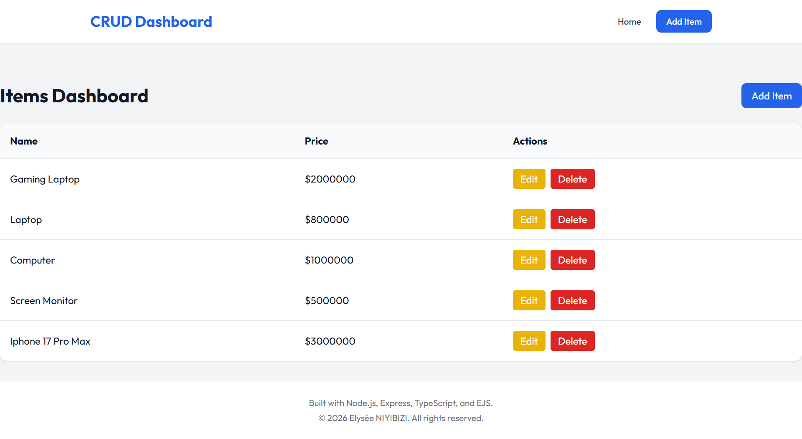
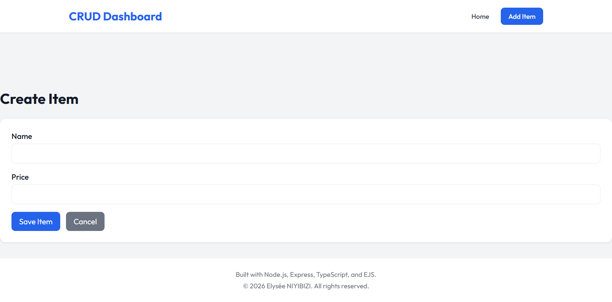

<div align="center">

# 🚀 _CRUD API with Express, TypeScript & EJS_ 🛜

A production-ready full-stack CRUD application with server-side rendering, RESTful API, and beautiful UI


### **Built with modern web technologies:**


## 🚀 Live Demo

| Dashboard Page                            | Item Creation Page                            |
| ----------------------------------------- | --------------------------------------------- |
|  |  |

</div>

---

## 📋 Table of Contents

- [✨ Features](#-features)
- [🛠️ Tech Stack](#️-tech-stack)
- [🏗️ System Architecture](#️-system-architecture)
- [📁 Project Structure](#-project-structure)
- [🎨 UI Pages & Routes](#-ui-pages--routes)
- [⚙️ Installation & Setup](#️-installation--setup)
- [🚀 Running the Project](#-running-the-project)
- [📡 REST API Endpoints](#-rest-api-endpoints)
- [🌐 Web Interface](#-web-interface)
- [🧪 Testing Guide](#-testing-guide)
- [📊 HTTP Status Codes](#-http-status-codes)
- [🎯 Key Implementation Details](#-key-implementation-details)
- [🔮 Future Roadmap](#-future-roadmap)
- [👨‍💻 Author](#-author)
- [📄 License](#-license)

---

## ✨ Features

| Category              | Features                                            | Status |
| --------------------- | --------------------------------------------------- | ------ |
| **REST API**          | Full CRUD operations (Create, Read, Update, Delete) | ✅     |
| **Web UI**            | Server-rendered dashboard with EJS templates        | ✅     |
| **Forms**             | Create and edit items with intuitive forms          | ✅     |
| **HTTP Methods**      | PUT & DELETE support via method-override            | ✅     |
| **Styling**           | Tailwind CSS with Outfit font for modern UI         | ✅     |
| **Persistence**       | JSON file storage using Node.js `fs` module         | ✅     |
| **Type Safety**       | Full TypeScript implementation                      | ✅     |
| **Architecture**      | Clean separation of concerns (MVC pattern)          | ✅     |
| **ID Generation**     | UUID-based unique identifiers                       | ✅     |
| **Responsive Design** | Mobile-friendly dashboard                           | ✅     |
| **Error Handling**    | Proper error messages and status codes              | ✅     |

---

## 🛠️ Tech Stack

<div align="center">

| Technology          | Version | Purpose               | Badge                                                                                             |
| ------------------- | ------- | --------------------- | ------------------------------------------------------------------------------------------------- |
| **Node.js**         | 18+     | JavaScript Runtime    |         |
| **Express.js**      | 4.x     | Web Framework         |        |
| **TypeScript**      | 5.x     | Type Safety           |  |
| **EJS**             | 3.x     | Template Engine       |                       |
| **Tailwind CSS**    | CDN     | Utility-first CSS     |     |
| **UUID**            | 9.x     | ID Generation         |              |
| **Method Override** | 3.x     | HTTP Method Tunneling |                        |

</div>

---

## 🏗️ System Architecture

The application follows a **clean layered architecture** with clear separation between API and UI concerns:

```console
┌─────────────────────────────────────────────────────────────────┐
│                         Client Browser                          │
│                    (Web UI or API Client)                       │
└────────────┬────────────────────────────┬──────────────────────┘
             │                            │
             ↓                            ↓
    ┌────────────────┐           ┌────────────────┐
    │   Web Routes   │           │   API Routes   │
    │  (view.routes) │           │ (item.routes)  │
    └────────┬───────┘           └────────┬───────┘
             │                            │
             ↓                            ↓
    ┌────────────────┐           ┌────────────────┐
    │ View Controller│           │Item Controller │
    │ (render pages) │           │ (handle API)   │
    └────────┬───────┘           └────────┬───────┘
             │                            │
             └────────────┬───────────────┘
                          ↓
                 ┌────────────────┐
                 │Item Service    │
                 │(business logic)│
                 └────────┬───────┘
                          ↓
                 ┌────────────────┐
                 │File Handler    │
                 │(JSON storage)  │
                 └────────┬───────┘
                          ↓
                 ┌────────────────┐
                 │   data.json    │
                 │(persistence)   │
                 └────────────────┘
```

### Component Responsibilities:

| Layer           | Responsibility                          | Files                                      |
| --------------- | --------------------------------------- | ------------------------------------------ |
| **Routes**      | Define endpoints and HTTP methods       | `item.routes.ts`, `view.routes.ts`         |
| **Controllers** | Handle requests/responses, render views | `item.controller.ts`, `view.controller.ts` |
| **Services**    | Business logic and CRUD operations      | `item.service.ts`                          |
| **Utils**       | Reusable helpers (file operations)      | `fileHandler.ts`                           |
| **Views**       | Server-side rendered pages              | `*.ejs` files                              |
| **Types**       | TypeScript interfaces                   | `item.types.ts`                            |

---

## 📁 Project Structure

```console
crud-exercise/
│
├── 📁 src/
│   │
│   ├── 📁 controllers/
│   │   ├── 📄 item.controller.ts      # API request handlers
│   │   └── 📄 view.controller.ts      # Web page renderers
│   │
│   ├── 📁 routes/
│   │   ├── 📄 item.routes.ts          # REST API endpoints
│   │   └── 📄 view.routes.ts          # Web page routes
│   │
│   ├── 📁 services/
│   │   └── 📄 item.service.ts         # Business logic & CRUD
│   │
│   ├── 📁 utils/
│   │   └── 📄 fileHandler.ts          # JSON file operations
│   │
│   ├── 📁 types/
│   │   └── 📄 item.types.ts           # TypeScript interfaces
│   │
│   ├── 📁 views/
│   │   ├── 📁 partials/
│   │   │   ├── 📄 header.ejs          # Shared navigation bar
│   │   │   └── 📄 footer.ejs          # Shared footer
│   │   ├── 📄 index.ejs               # Dashboard homepage
│   │   ├── 📄 create.ejs              # Create item form
│   │   └── 📄 edit.ejs                # Edit item form
│   │
│   ├── 📁 data/
│   │   └── 📄 data.json               # Persistent storage
│   │
│   └── 📄 server.ts                   # Application entry point
│
├── 📄 package.json                    # Dependencies & scripts
├── 📄 tsconfig.json                   # TypeScript configuration
├── 📄 .gitignore                      # Git ignore rules
└── 📄 README.md                       # Documentation
```

---

## 🎨 UI Pages & Routes

### Web Interface Pages

| Route       | Page        | Description          | Features                    |
| ----------- | ----------- | -------------------- | --------------------------- |
| `/`         | Dashboard   | List all items       | View, Edit, Delete buttons  |
| `/create`   | Create Form | Add new item         | Input validation, POST form |
| `/edit/:id` | Edit Form   | Update existing item | Pre-filled values, PUT form |

### UI Components

- 🎨 **Responsive Dashboard** - Clean card-based layout
- 📝 **Create Form** - Intuitive input fields
- ✏️ **Edit Form** - Auto-populated with existing data
- 🗑️ **Delete Button** - With confirmation dialog
- 📋 **Shared Partials** - Consistent header/footer
- 🎯 **Tailwind Styling** - Modern, responsive design
- 🔤 **Outfit Font** - Clean typography
- ⚡ **Dynamic Copyright** - Auto-updating year

---

## ⚙️ Installation & Setup

### Prerequisites

- **Node.js** (v18 or higher)
- **npm** or **yarn** package manager
- **Git** (for cloning)

### Quick Start

```console
# Clone the repository
git clone https://github.com/elyse502/crud-exercise.git

# Navigate to project directory
cd crud-exercise

# Install dependencies
npm install
```

### Environment Configuration (Optional)

Create a `.env` file in the root directory:

```env
PORT=3000
NODE_ENV=development
```

---

## 🚀 Running the Project

### Development Mode (with auto-reload)

```console
npm run dev
```

> Uses `nodemon` for hot reloading during development
> Server runs at: `http://localhost:3000`

### Production Build

```console
npm run build
```

> Compiles TypeScript to JavaScript in the `dist/` folder

### Production Start

```console
npm start
```

> Runs the compiled JavaScript from `dist/` folder

---

## 📡 REST API Endpoints

**Base URL:** `http://localhost:3000/api/items`

| Method     | Endpoint         | Description          | Response            |
| ---------- | ---------------- | -------------------- | ------------------- |
| **GET**    | `/api/items`     | Fetch all items      | Array of items      |
| **POST**   | `/api/items`     | Create new item      | Created item object |
| **PUT**    | `/api/items/:id` | Update existing item | Updated item object |
| **DELETE** | `/api/items/:id` | Delete item          | Success message     |

### Example API Requests

#### 📥 GET All Items

```console
curl http://localhost:3000/api/items
```

**Response:**

```json
[
  {
    "id": "550e8400-e29b-41d4-a716-446655440000",
    "name": "Laptop",
    "price": 1200
  }
]
```

#### 📤 POST Create Item

```console
curl -X POST http://localhost:3000/api/items \
  -H "Content-Type: application/json" \
  -d '{"name":"Laptop","price":1200}'
```

**Response:**

```json
{
  "message": "Item created successfully",
  "data": {
    "id": "generated-uuid",
    "name": "Laptop",
    "price": 1200
  }
}
```

#### 📝 PUT Update Item

```console
curl -X PUT http://localhost:3000/api/items/550e8400-e29b-41d4-a716-446655440000 \
  -H "Content-Type: application/json" \
  -d '{"name":"Gaming Laptop","price":1500}'
```

#### 🗑️ DELETE Item

```console
curl -X DELETE http://localhost:3000/api/items/550e8400-e29b-41d4-a716-446655440000
```

---

## 🌐 Web Interface

### Access the Application

Open your browser and navigate to:

```console
http://localhost:3000
```

### Page Previews

| Page                        | Description                         | Actions            |
| --------------------------- | ----------------------------------- | ------------------ |
| **Dashboard** (`/`)         | View all items in a responsive grid | Edit ✏️, Delete 🗑️ |
| **Create Item** (`/create`) | Fill form to add new item           | Submit ➕          |
| **Edit Item** (`/edit/:id`) | Modify existing item details        | Update 💾          |

### UI Features Showcase

- ✅ **Clean dashboard** with item cards
- ✅ **Create form** with validation
- ✅ **Edit form** with pre-filled values
- ✅ **Delete confirmation** to prevent accidents
- ✅ **Responsive design** works on all devices
- ✅ **Consistent layout** with partials
- ✅ **Visual feedback** with hover effects

---

## 🧪 Testing Guide

### Test Using Browser UI

1. **Create:** Visit `/create` → Fill form → Submit
2. **Read:** Visit `/` → View all items
3. **Update:** Click "Edit" on any item → Modify → Submit
4. **Delete:** Click "Delete" → Confirm deletion

### Test Using Postman/Thunder Client

| Tool               | Instructions                                 |
| ------------------ | -------------------------------------------- |
| **Postman**        | Import collection or test endpoints manually |
| **Thunder Client** | VS Code extension for quick testing          |
| **Insomnia**       | Cross-platform API client                    |
| **cURL**           | Command-line testing                         |

### Sample Test Flow

```console
# 1. Create an item
curl -X POST http://localhost:3000/api/items \
  -H "Content-Type: application/json" \
  -d '{"name":"Test Item","price":100}'

# 2. Get all items
curl http://localhost:3000/api/items

# 3. Update the item (use the ID from step 1)
curl -X PUT http://localhost:3000/api/items/[ID] \
  -H "Content-Type: application/json" \
  -d '{"name":"Updated Item","price":150}'

# 4. Delete the item
curl -X DELETE http://localhost:3000/api/items/[ID]
```

---

## 📊 HTTP Status Codes

| Status Code | Meaning         | When it occurs                         |
| ----------- | --------------- | -------------------------------------- |
| **200**     | ✅ OK           | GET, PUT, DELETE successful            |
| **201**     | 🆕 Created      | POST successful resource creation      |
| **400**     | ❌ Bad Request  | Invalid request body or missing fields |
| **404**     | 🔍 Not Found    | Item with given ID doesn't exist       |
| **500**     | 💥 Server Error | File system or internal server error   |

---

## 🎯 Key Implementation Details

### Method Override for HTML Forms

HTML forms only support GET and POST methods. To support PUT and DELETE:

```html
<!-- In edit.ejs form -->
<input type="hidden" name="_method" value="PUT" />
```

```javascript
// In server.ts
import methodOverride from "method-override";
app.use(methodOverride("_method"));
```

### EJS Template Structure

```ejs
<!-- header.ejs - Shared navigation -->
<header>...</header>

<!-- index.ejs - Dashboard -->
<%- include('partials/header') %>
<div class="container">...</div>
<%- include('partials/footer') %>
```

### Data Persistence with JSON

```typescript
// fileHandler.ts
export const readData = async (): Promise<Item[]> => {
  const data = await fs.readFile(filePath, "utf-8");
  return JSON.parse(data);
};

export const writeData = async (data: Item[]): Promise<void> => {
  await fs.writeFile(filePath, JSON.stringify(data, null, 2));
};
```

---

## 🔮 Future Roadmap

| Feature                     | Priority | Description                             |
| --------------------------- | -------- | --------------------------------------- |
| 🗄️ **Database Integration** | High     | Migrate from JSON to PostgreSQL/MongoDB |
| 🔐 **Authentication**       | High     | JWT-based user authentication           |
| 🛡️ **Input Validation**     | Medium   | Add Zod or Joi for request validation   |
| 🧪 **Testing Suite**        | Medium   | Unit & integration tests with Jest      |
| 📚 **API Documentation**    | Medium   | Swagger/OpenAPI integration             |
| 🐳 **Docker Support**       | Low      | Containerize the application            |
| 🚦 **Rate Limiting**        | Low      | Prevent API abuse                       |
| 🔄 **CI/CD Pipeline**       | Low      | Automated deployment                    |
| 📱 **Mobile App**           | Low      | React Native mobile client              |

---

## 🐛 Troubleshooting

| Issue                             | Solution                                                    |
| --------------------------------- | ----------------------------------------------------------- |
| **Port already in use**           | Change PORT in `.env` or kill process using `lsof -i :3000` |
| **TypeScript compilation errors** | Run `npm run build` to see detailed errors                  |
| **Data not persisting**           | Check write permissions for `/data` folder                  |
| **Method Override not working**   | Ensure `_method` hidden field is present in forms           |

---

## 👨‍💻 Author

### **Elysée NIYIBIZI**

_Junior Fullstack Software Engineer_

<div align="center">

[](https://elyseedev.netlify.app)
[](https://github.com/elyse502)
[](https://linkedin.com/in/niyibizi-elysée)
[](mailto:elyseniyibizi502@gmail.com)

</div>

---

## 📄 License

This project is licensed under the **MIT License** - see the [LICENSE](https://github.com/elyse502/crud-exercise/blob/ft/ejs-integration/LICENSE) file for details.

```
MIT License

Copyright (c) 2026 Elysée NIYIBIZI

Permission is hereby granted, free of charge, to any person obtaining a copy
of this software and associated documentation files (the "Software"), to deal
in the Software without restriction...
```

---

## 🙏 Acknowledgments

- **Express.js** - Robust web framework
- **TypeScript** - Type safety and better DX
- **EJS** - Simple templating
- **Tailwind CSS** - Rapid UI development
- **Method Override** - RESTful form support

---

<div align="center">

### ⭐ Star this repository if it helped you learn full-stack development!

**Built with 💻, TypeScript, and Server-Side Rendering**

---

_Have questions or suggestions? Open an issue or reach out!_

</div>
